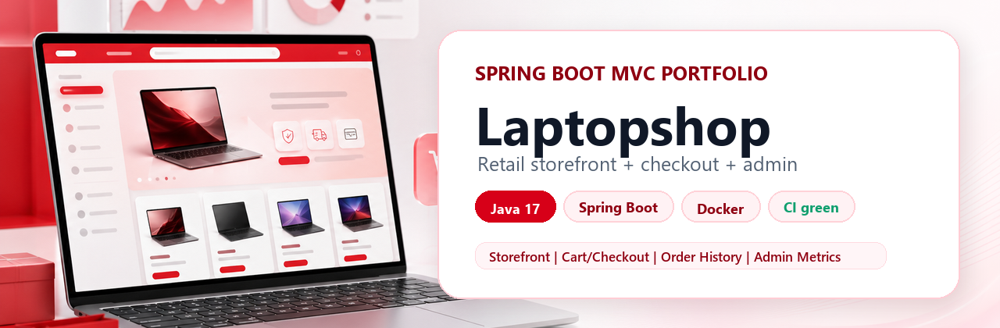

# Laptopshop



[](https://github.com/JasonTM17/laptopshop-spring-boot-mvc/actions/workflows/ci.yml)
[](https://github.com/JasonTM17/laptopshop-spring-boot-mvc/releases)


[](https://github.com/users/JasonTM17/packages/container/package/laptopshop-spring-boot-mvc)
[](LICENSE.MD)

**Laptopshop is a Spring Boot MVC laptop e-commerce portfolio app with a polished retail storefront, customer checkout, admin dashboard, automated tests, Docker, and CI.**

Built for recruiter review and technical screening: the first minute shows the product, the next five minutes prove the engineering.

## 60-Second Review

| What to check | Route or file |
| --- | --- |
| Storefront and catalog | `/` -> `/products` -> `/product/1` |
| Customer flow | login as customer -> `/cart` -> `/checkout` -> `/order-history` |
| Admin flow | login as admin -> `/admin` -> products, users, orders |
| Test, CI, container | [GitHub Actions](https://github.com/JasonTM17/laptopshop-spring-boot-mvc/actions), [GHCR package](https://github.com/users/JasonTM17/packages/container/package/laptopshop-spring-boot-mvc), and `.\mvnw.cmd package` |
| Setup in 3 minutes | [INSTALLATION.md](INSTALLATION.md) |

## Demo Accounts

| Role | Email | Password |
| --- | --- | --- |
| Admin | `admin@laptopshop.dev` | `Admin@123` |
| Customer | `customer@laptopshop.dev` | `Customer@123` |

The `local` profile seeds demo roles, accounts, products, a customer cart, and order history on an empty database.

## Quick Start

```powershell
git clone https://github.com/JasonTM17/laptopshop-spring-boot-mvc.git
cd laptopshop-spring-boot-mvc

docker compose up --build
```

Container image:

```powershell
docker pull ghcr.io/jasontm17/laptopshop-spring-boot-mvc:latest
```

Open:

```text
http://localhost:8080
```

Without Docker:

```powershell
$env:SPRING_PROFILES_ACTIVE = "local"
$env:MYSQL_PASSWORD = "your_mysql_password"
.\mvnw.cmd spring-boot:run
```

## Product Gallery

| Home | Catalog |
| --- | --- |
|  |  |

| Product detail | Cart |
| --- | --- |
|  |  |

| Order history | Admin dashboard |
| --- | --- |
|  |  |

| About |
| --- |
|  |

## Highlights

- Retail-style storefront with red Laptopshop branding, category navigation, promo sections, dense product cards, and responsive layout.
- Catalog search, product suggestions, filters, sorting, active chips, and pagination.
- Product detail with promo blocks, warranty/support content, add-to-cart, and buy-now shortcut.
- Cart and checkout with quantity validation, stock validation, payment method, order creation, stock decrement, and sold-count update.
- Account profile, password change, address information, and order history.
- Admin dashboard with real metrics, revenue/factory charts, low-stock list, recent activity, search/filter, order status validation, and CSV export.
- Production-minded setup: Spring profiles, env vars, Docker Compose, Render blueprint, health endpoint, sitemap, robots, cacheable static assets, and CI.

## Tech Stack

| Layer | Stack |
| --- | --- |
| Backend | Java 17, Spring Boot 3.5.14, Spring MVC, Spring Security |
| Views | JSP, JSTL, Bootstrap Icons, custom CSS design system |
| Data | Spring Data JPA, Hibernate, MySQL, H2 for tests |
| Tooling | Maven Wrapper, Docker, Docker Compose, GitHub Actions |

## Tests

```powershell
.\mvnw.cmd test
.\mvnw.cmd package
docker build -t laptopshop:ci .
```

Current coverage includes register validation, catalog filtering, suggestion API, cart operations, checkout/order creation, API JSON auth failures, public route smoke, customer flow, admin metrics, CSV export, and order status validation.

## Useful Routes

| Area | Route |
| --- | --- |
| Home | `/` |
| Catalog | `/products` |
| Product detail | `/product/{id}` |
| Login / Register | `/login`, `/register` |
| Cart / Checkout | `/cart`, `/checkout` |
| Account / Orders | `/account`, `/order-history` |
| About | `/about` |
| Admin | `/admin` |
| Product suggestions API | `/api/products/suggest?name=mac` |
| Admin order CSV | `/admin/report/orders.csv` |

<details>
<summary><strong>Configuration</strong></summary>

The app uses Spring profiles and environment variables. Secrets are not hard-coded in `application.properties`.

Default local environment:

```powershell
$env:SPRING_PROFILES_ACTIVE = "local"
$env:MYSQL_HOST = "localhost"
$env:MYSQL_PORT = "3306"
$env:MYSQL_DATABASE = "laptopshop"
$env:MYSQL_USER = "root"
$env:MYSQL_PASSWORD = "your_mysql_password"
$env:APP_DEMO_SEED = "true"
$env:APP_BASE_URL = "http://localhost:8080"
```

Production environment:

```text
SPRING_PROFILES_ACTIVE=prod
SPRING_DATASOURCE_URL=jdbc:mysql://host:3306/laptopshop
SPRING_DATASOURCE_USERNAME=...
SPRING_DATASOURCE_PASSWORD=...
JPA_DDL_AUTO=validate
SPRING_SESSION_JDBC_INITIALIZE_SCHEMA=never
PORT=8080
APP_BASE_URL=https://your-live-demo.example
```

See [docs/DEPLOYMENT.md](docs/DEPLOYMENT.md) for deployment notes.

</details>

<details>
<summary><strong>Documentation Map</strong></summary>

- [INSTALLATION.md](INSTALLATION.md) - 3-minute local setup.
- [RELEASE_NOTES.md](RELEASE_NOTES.md) - release summary and known limits.
- [docs/ABOUT.md](docs/ABOUT.md) - project story and product scope.
- [docs/REVIEWER_GUIDE.md](docs/REVIEWER_GUIDE.md) - recommended review script.
- [docs/FEATURE_MATRIX.md](docs/FEATURE_MATRIX.md) - feature coverage.
- [docs/ARCHITECTURE.md](docs/ARCHITECTURE.md) - architecture notes.
- [docs/TESTING.md](docs/TESTING.md) - test strategy.
- [docs/DEPLOYMENT.md](docs/DEPLOYMENT.md) - deployment notes.
- [docs/SHOWCASE.md](docs/SHOWCASE.md) - portfolio walkthrough script.
- [docs/GITHUB_REPO_SETUP.md](docs/GITHUB_REPO_SETUP.md) - GitHub metadata checklist.
- [CONTRIBUTING.md](CONTRIBUTING.md) and [SECURITY.md](SECURITY.md).

</details>

<details>
<summary><strong>Project Structure</strong></summary>

```text
src/main/java/vn/hoidanit/laptopshop
  config/               security, auth, MVC config
  controller/           client and admin controllers
  domain/               JPA entities and DTOs
  repository/           Spring Data repositories
  service/              business logic
  service/specification product filtering specs
  service/validator     form validators

src/main/webapp
  WEB-INF/view          JSP pages
  resources/css         design system and app styles
  resources/js          shared UI helpers
  resources/client/js   storefront behavior

database/laptopshop.sql seed schema and demo data
docs/screenshots        portfolio screenshots and GitHub assets
```

</details>

## Release Status

Current target release: **v1.0.2 Visual Portfolio Polish**.

The app is intended for GitHub portfolio review, recruiter demos, and local technical evaluation. Wishlist and payment gateway behavior are intentionally scoped for portfolio use, not production commerce.
